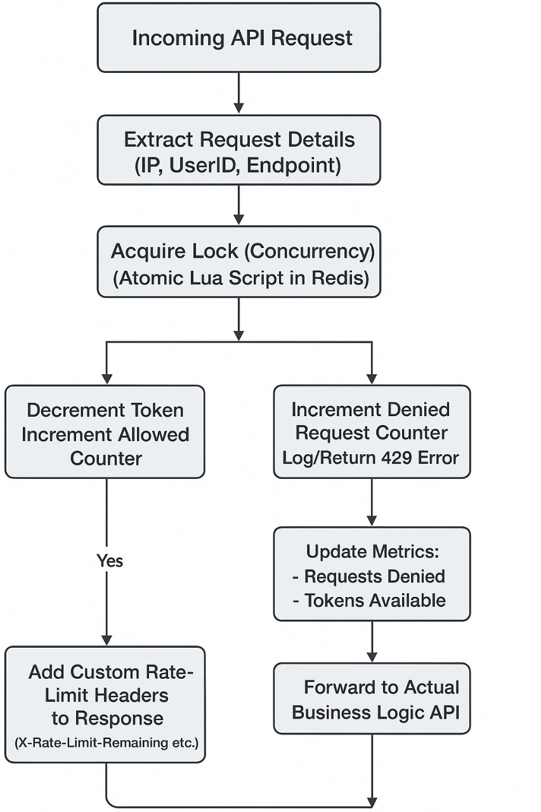

<h1>⚡ Distributed Rate Limiter (Java + Spring Boot)</h1>
    
A <strong>distributed, concurrency-safe rate limiter</strong> for REST APIs built using <strong>Java, Spring Boot, and Redis</strong>.  
    Implements the <strong>Token Bucket algorithm</strong> to handle traffic spikes gracefully and ensure fair usage across users/IPs — even across multiple server instances.

        <h2>📸 Architecture Overview</h2>
        

            
        

        
<strong>High-level Flow:</strong>

        <ol>
            <li>Incoming request hits a controller endpoint annotated with <code>@RateLimit</code>.</li>
            <li>A custom Aspect intercepts the call before controller execution.</li>
            <li>Token availability is checked in Redis (per user/IP key).</li>
            <li>If a token is available:
                <ul>
                    <li>Consumed atomically via Redis transaction (WATCH/MULTI/EXEC).</li>
                    <li>Request proceeds to controller.</li>
                </ul>
            </li>
            <li>If no token is available:
                <ul>
                    <li>Returns HTTP <code>429 Too Many Requests</code>.</li>
                </ul>
            </li>
            <li>Metrics are updated (Micrometer → Prometheus).</li>
            <li>Response is sent with rate-limit headers.</li>
        </ol>
    

        <h2>🚀 Features</h2>
        <ul>
            <li>⏳ <strong>Token Bucket Algorithm</strong> – Per-user / per-IP rate limiting.</li>
            <li>⚡ <strong>Annotation-based Configuration</strong> – Use <code>@RateLimit</code> to set custom capacity & refill rates.</li>
            <li>🧵 <strong>Thread-safe Token Consumption</strong> – Atomic operations using Redis transactions.</li>
            <li>🔁 <strong>Retry Logic</strong> – Automatically retries on transaction conflicts.</li>
            <li>📊 <strong>Metrics Integration</strong> – Micrometer + Prometheus for real-time observability.</li>
            <li>📬 <strong>Custom Rate Limit Headers</strong> – Adds <code>X-RateLimit-Limit</code>, <code>X-RateLimit-Remaining</code>, <code>X-RateLimit-Reset</code>.</li>
            <li>🚫 <strong>HTTP 429 Handling</strong> – Centralized exception handling when limit is breached.</li>
            <li>⚙️ <strong>Distributed Safe</strong> – Works across multiple instances using a shared Redis store.</li>
        </ul>
    

        <h2>🧠 Why Use a Rate Limiter?</h2>
        <ul>
            <li>Prevents API abuse by controlling request frequency.</li>
            <li>Improves system <strong>resilience and stability</strong> during traffic spikes.</li>
            <li>Ensures fair usage among all clients.</li>
            <li>Reduces infrastructure costs by avoiding overload.</li>
            <li>Provides visibility into traffic patterns via metrics.</li>
        </ul>
    

        <h2>🛠 Tech Stack</h2>
        <ul>
            <li>Java 17+</li>
            <li>Spring Boot</li>
            <li>Redis</li>
            <li>Micrometer</li>
            <li>Prometheus</li>
        </ul>
    

        <h2>🧩 Usage Example</h2>
        <pre>
@RateLimit(
    capacity = 10,
    refillTokensPerSecond = 5
)
@GetMapping("/api/data")
public ResponseEntity&lt;String&gt; getData() {
    return ResponseEntity.ok("Success!");
}
        </pre>
    

        <h2>📈 Exposed Metrics</h2>
        <ul>
            <li><code>rate_limiter_requests_allowed</code> – Total allowed requests</li>
            <li><code>rate_limiter_requests_denied</code> – Total denied requests</li>
            <li><code>rate_limiter_tokens_available{user="&lt;user&gt;"}</code> – Available tokens per user/IP</li>
        </ul>
        
These metrics can be scraped using Prometheus and visualized with Grafana dashboards.

    

        <h2>📬 Custom HTTP Headers</h2>
        <pre>
X-RateLimit-Limit: 10
X-RateLimit-Remaining: 4
X-RateLimit-Reset: 45
        </pre>
        <ul>
            <li><strong>X-RateLimit-Limit:</strong> Maximum allowed requests in the current window</li>
            <li><strong>X-RateLimit-Remaining:</strong> Remaining requests allowed</li>
            <li><strong>X-RateLimit-Reset:</strong> Seconds until the limit resets</li>
        </ul>
        
When the rate limit is exceeded:

        <pre>
HTTP/1.1 429 Too Many Requests
Retry-After: 45
        </pre>
    

        <h2>⚡ Setup Instructions</h2>
        <ol>
            <li><strong>Clone the Repository</strong>
                <pre>
git clone https://github.com/Gautam-10137/rate-limiter-service.git
cd rate-limiter-service
                </pre>
            </li>
            <li><strong>Run Redis locally</strong>
                <pre>redis-server</pre>
            </li>
            <li><strong>Configure Redis in <code>application.properties</code></strong>
                <pre>
spring.redis.host=localhost
spring.redis.port=6379
                </pre>
            </li>
            <li><strong>Build and Run the App</strong>
                <pre>./mvnw spring-boot:run</pre>
            </li>
            <li><strong>Test API Endpoints</strong>  
            Use Postman or curl to call endpoints annotated with <code>@RateLimit</code>.</li>
        </ol>
    

        <h2>👨‍💻 Author</h2>
        
Gautam Pahwa

    

